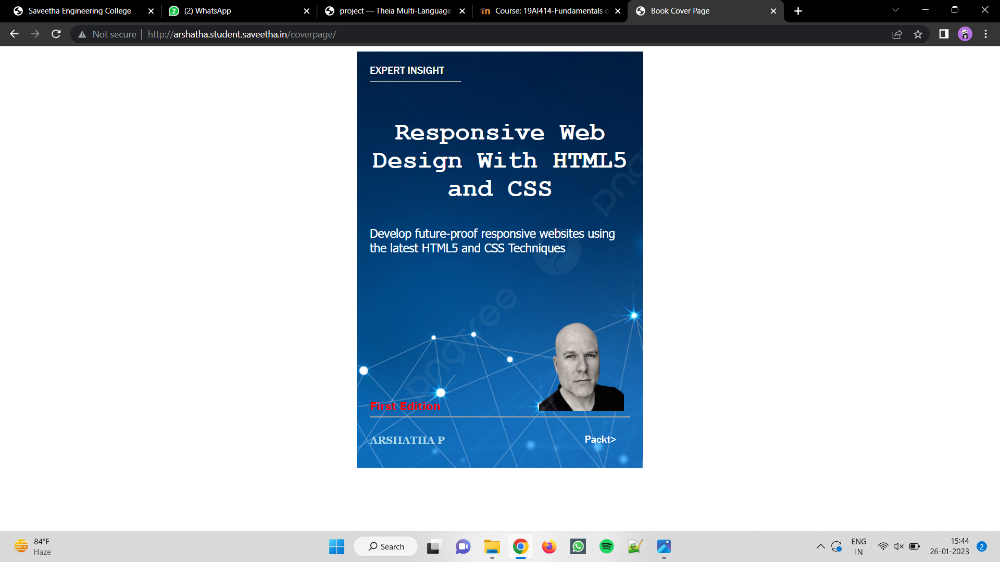
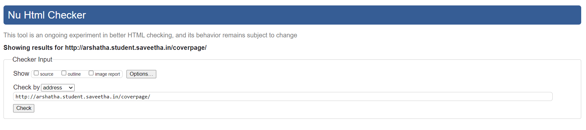

# Book CoverPage Design

## AIM:

To design a static web site for a book cover page.

## DESIGN STEPS:

### Step 1:
Create a new Django project and app.

### Step 2:
Create a static file directory and mention the changes in settings

### Step 3:

Make a new folder templates inside your app and create a html and map them using views and url.
### Step 4:
Write down the code for book cover using HTML and CSS.

### Step 5:
Add images and other contents using CSS record a screenshot of it.

## PROGRAM :
  ## CODE:
```
<!DOCTYPE html>
<html lang="en">
    <head>
         <meta name="viewport" 
         content="width=device-width, initial-scale=1.0">
         <style>

        .bookpage{
            width: 400px;
            height: 600px;
            background-color: #3d3a3a;
            color:white;
            margin-left: auto;
            margin-right: auto;
            padding: 20px;
            font-family: 'Franklin Gothic Medium', 'Arial Narrow', Arial, sans-serif;
            background-image: url(https://png.pngtree.com/background/20210710/original/pngtree-technology-background-technological-sense-science-fiction-modern-picture-image_976242.jpg);
            background-size: cover;
        }
            

        .toptext{
            color:white;

        }

        
        .tophr{
            width:140px;
        }
        .author{
            color: white;
            display: inline;
            position: relative;
            color:lightblue;
            top:190px;
            
            font-family:Georgia;
            font-size: medium;
        }
        .booktitle{
            font-family: 'Courier New', Courier, monospace;
            font-size: larger;
            text-align: center;
            position: relative;
            top: 30px;
        
        }
        .id {
            width:400px;
            position: relative;
            top:180px;
            
        }
        .publisher{
            font-size: medium;
            position: relative;
            top:155px;
            left:330px;
        }
        .edition{
            color:red;
            font-size: medium;
            font-family: Verdana;
            position:relative;
            top:85px;

        }
        .subtitle{
            font-family:Tahoma;
            font-size: large;
            position: relative;
            top:40px;
        }
        .photo{
            position: relative;
            top: 135px;
            left: 260px;
            width: 100px;
            height: 100px;
            background-size: cover;
        }
        </style>
        <title>Book Cover Page</title>
    </head>
    <body>
        <div class="bookpage">
            <div class="toptext">
                EXPERT INSIGHT
            </div>
            <div class="tophr">
                <hr style="color: red;">
            </div>
            <div class="booktitle">
                <h1>Responsive Web Design With HTML5 and CSS</h1></div>
            <div class="subtitle">
                Develop future-proof responsive websites using the latest HTML5 and CSS Techniques
            </div>
            <div class="photo">
                
            </div>
            <div class="id">
                <hr style="color: orange;">
            </div>
            <div class="author">
               <p><b>ARSHATHA P</b></p>
            </div>
            <div class="publisher">
                Packt>
            </div>
            <div class="edition">
                <b>First Edition</b>
            </div>
            
        </div>
    </body>
</html>
```

## OUTPUT:


## VALIDATOR:



## Result:
Thus a website to display the cover page design of a book was successfully created.
